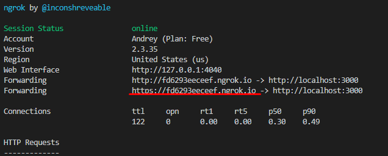
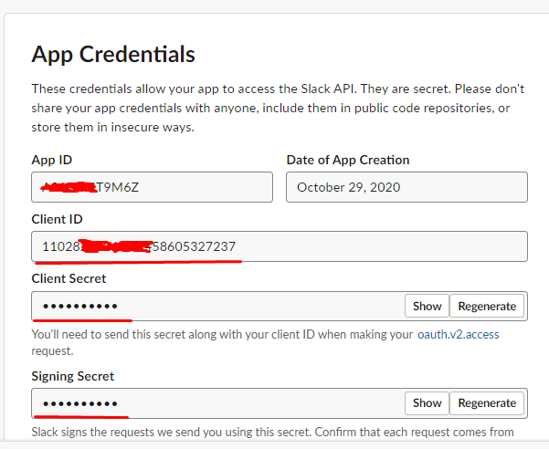
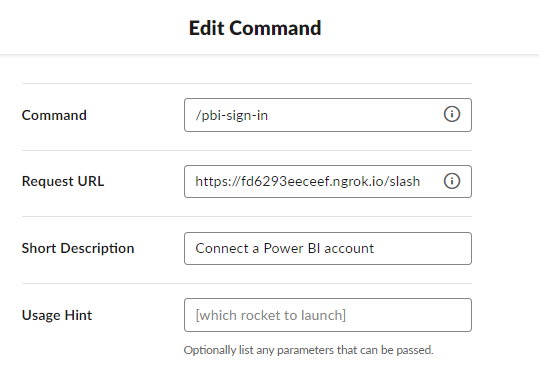

# Slack-PowerBI-integration
Slack application that allows to share PowerBI reports in your workspace

## it contains 2 Golang app repos:
Report-engine for render powerBI reports
and
Spbibot Slack bot that can connect to your PowerBI account

# Project setup

The page is about setting up a local development environment as well as project deployment.

- Start ngrok `ngrok http 3000`    


- Data for `.env` in Slack api App  


- Connect ngrok and Slack   

---

## Staging environment

### VM preparation

You can find the instance by name `spbi-main-staging`.

#### Prerequisites

```shell script
# Set restrictive permissions.
chmod 'u=r,go=' '.pem'

# Connect to VM.
ssh -i '.pem' 'location'

# Perform maintenance tasks.
sudo apt update
sudo apt upgrade --yes

# Install Chrome.
wget --quiet --output-document - 'https://dl.google.com/linux/linux_signing_key.pub' | sudo apt-key add -
echo 'deb [arch=amd64] https://dl.google.com/linux/chrome/deb/ stable main' | sudo tee '/etc/apt/sources.list.d/google-chrome.list'
sudo apt update
sudo apt install --yes 'google-chrome-stable'

# Check Chrome installation.
google-chrome-stable --headless --disable-gpu --dump-dom 'https://www.chromestatus.com/'

# Install Chrome (alternative way).
wget 'https://dl.google.com/linux/direct/google-chrome-stable_current_amd64.deb'
sudo apt install './google-chrome-stable_current_amd64.deb'

# Configure swap.
sudo dd bs=1M conv=excl,fsync count=2048 if='/dev/zero' of='/swap' status=progress
sudo chmod 'u=rw,go=' '/swap'
sudo mkswap '/swap'
sudo swapon --discard '/swap'

# Check swap configuration.
sudo swapon --show

# Make swap permanent.
echo '/swap swap swap defaults,discard 0 0' | sudo tee --append '/etc/fstab'
```

#### DB setup

You can find the instance by identifier `spbi-db-staging`.

```shell script
# Install MySQL client (DB instance can only be accessed from inside VPC).
sudo apt install --yes mysql-client-8.0

# Connect to DB.
mysql --user='your_username' --password="Your_password" --host='your_DB_location'

# Execute pending migration scripts.
source {{script}}.sql
```

#### TLS setup

```shell script
# HACK: Install ngrok.
wget 'https://bin.equinox.io/c/4VmDzA7iaHb/ngrok-stable-linux-amd64.zip'
sudo apt install --yes unzip
unzip './ngrok-stable-linux-amd64.zip'
./ngrok authtoken 'your_token'
./ngrok http --log 'ngrok.log' --log-format json --log-level info 80 &>/dev/null &

# Retrieve public HTTPS URL.
sudo apt install --yes jq
curl --silent 'http://localhost:4040/api/tunnels' | jq '.tunnels | .[] | select(.proto == "https") | .public_url'
```

If you have a sufficient access level, you can find both service's `.env` file, SSH private key file & job configuration under *CI / CD Variables*; their names are prefixed w/ `STAGING_`.

##### Complete example of an `.env` for staging (or development) environment

```dotenv
ENV=development

SERVER_PORT=80
SERVER_TLSPORT=443
SERVER_CERTIFICATE=???
SERVER_KEY=???
SERVER_SHUTDOWNTIMEOUT=10

DB_PORT=3306
DB_HOST=???
DB_NAME=spbibot
DB_USERNAME=???
DB_USERNAME_PWD=???
TIMEOUT=2
USERID_HASH_COST=1

CLIENT_ID=???
CLIENT_SECRET=???
TENANT_ID=???
RESPONSE_MODE=query
RESPONSE_TYPE=code
POWER_BI_RESOURCE=https://analysis.windows.net/powerbi/api
POWERBICLIENT_APIURL=https://api.powerbi.com/v1.0/myorg

SLACK_SIGN_IN_SECRET=???
SLACK_VERIFYREQUESTS=true
SLACK_CLIENT_ID=???
SLACK_CLIENT_SECRET=???

LOGGER_LEVEL=debug
LOGGER_ENCODING=json
LOGGER_LEVELENCODER=lowercase
LOGGER_FILE=default.log
LOGGER_ERRORFILE=error.log
LOGGER_ENABLEFILE=true
LOGGER_ENABLESTDOUT=false
LOGGER_MAXSIZEMB=128
LOGGER_MAXAGEDAYS=84
LOGGER_MAXBACKUPS=8

FEATURETOGGLES_KILLALLALERTS=true
FEATURETOGGLES_REPORTSCHEDULING=true

BROWSER_HEADLESS=true
BROWSER_REDIRECTLOG=false
BROWSER_TABTIMEOUT=5m
BROWSER_MINACTIONTIMEOUT=15s
BROWSER_DEFAULTVIEWPORTHEIGHT=720
BROWSER_DEFAULTVIEWPORTWIDTH=1280
BROWSER_VIEWPORTMARGIN=64
BROWSER_DISPLAYDENSITY=1.0
BROWSER_RESOURCESDIRECTORY=resources
BROWSER_SCREENSHOTDELAY=2s

REQUESTLOGGING_ENABLE=true
REQUESTLOGGING_DUMPBODY=false

TESTAPI_CLIENTKEY=???
TESTAPI_ENABLE=true
```

### AAD setup

You can locate the app by name "Slack Power BI Integration (staging)".

## Read more docs in [wiki](https://github.com/akvelon/Slack-PowerBI-integration/tree/master/wiki) folder
